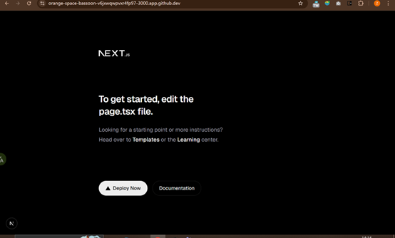
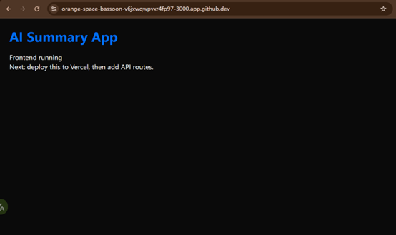
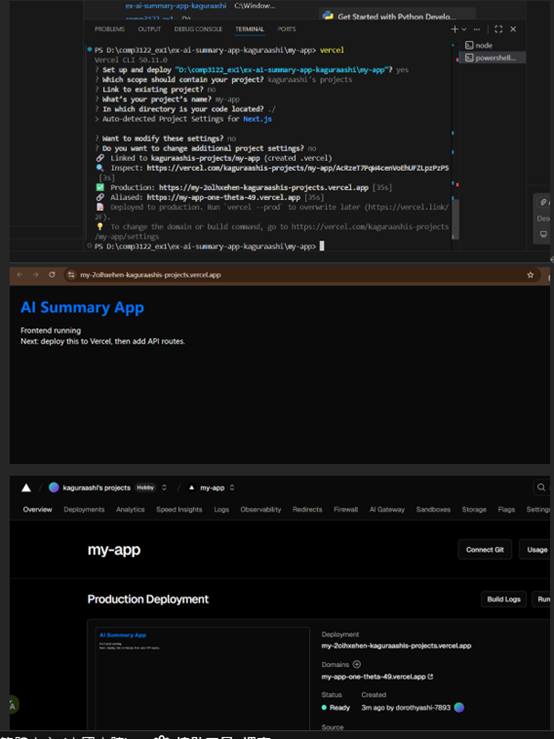
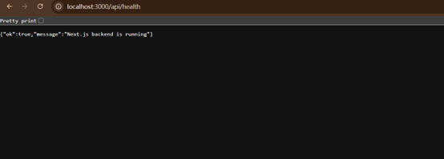
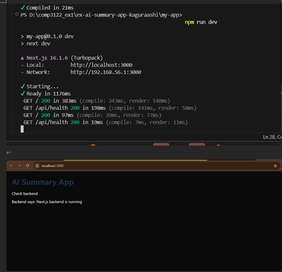

## Section 1: Overview

> **Note:** Due to an accidentally created `src` directory during setup, the structure of Task 1 was slightly modified.

Next.js is a React framework built on top of React. It supports server-side rendering, file-based routing, and API routes (serverless functions) out of the box. In this exercise, the frontend UI is implemented with the App Router, and the backend is implemented as API routes under src/app/api.

Here is the folder architecture of the app used in this repository:
- my-app is the root of the Next.js project
- my-app/src/app is the frontend App Router entry including page.tsx and layout.tsx
- my-app/src/app/api contains backend API routes as serverless functions such as health and later endpoints for upload and summarization
- my-app/src/app/lib contains shared helper modules such as API clients
- my-app/public contains static assets served directly
- my-app/package.json and my-app/next.config.ts store dependencies and configuration
- my-app/.env.local stores local environment variables and must not be committed to GitHub

Accounts used in this exercise:
- GitHub for repository and version control
- Vercel for deployment of the Next.js app
- Supabase for storage and Postgres database in Task 2
- GitHub Models or OpenRouter for LLM API access if OpenAI API is not available in the current region

## Section 2: Create a simple Next.js app

I created the starter repository using GitHub Classroom and opened the project locally in VS Code. I added a .gitignore early to avoid committing node_modules, build outputs, and any .env.local secrets.

I committed the repository regularly during development to match the requirement of regular commits.

## Section 3: Create the Next.js app

I scaffolded a Next.js app with TypeScript and Tailwind CSS.

Command used:
npx create-next-app@latest my-app --typescript --tailwind

I started the local dev server and verified the default Next.js starter page loads.

Then I replaced the default starter UI with a minimal landing UI in my-app/src/app/page.tsx to confirm the frontend is running before adding backend routes.

Then I deployed to Vercel and verified the production.

## Section 4: Add API Routes

I implemented a backend health check endpoint as a Next.js API route at my-app/src/app/api/health/route.ts so the frontend can verify the backend is running.

I tested it locally by visiting /api/health and confirmed it returns JSON.

## Section 5: Connect Frontend to Backend

I connected the frontend to the backend by adding a button on the home page to call /api/health. When clicking the button, the status text updates with the backend response, confirming frontend and backend communication works.

Finally, I deployed to Vercel again to ensure the updated UI works in production.
