## step by step guidance
Below is a detailed, beginner-friendly guide to reproduce my app from this repository. This section is written as a tutorial. The later sections (Section 6 onward) are my development notes and evidence.

### Prerequisites
You need:
- Node.js (LTS) and npmbo
- A Supabase project (Storage + Postgres)
- A GitHub Models token (for LLM summarization)
### Step 0 — (Optional, for beginners) Build this project from vary beginn

If you already cloned this repository, you can skip Step 0 and start from Step 1.  
I added Step 0 for complete beginners who want to understandn how the `src/` structure and key files are created, and how to rebuild the same app from an empty folder.

#### Step 0.1 — Create the Next.js App Router scaffold (creates `src/` automatically)
From an empty folder:

```bash
mkdir ex-ai-summary-app-kaguraashi
cd ex-ai-summary-app-kaguraashi

# Create Next.js app folder "my-app"
# IMPORTANT: choose App Router + Tailwind + TypeScript, and enable "src/" directory when prompted.
npx create-next-app@latest my-app --ts --eslint --tailwind --app --src-dir --use-npm
```

Expected results:
- You now have a `my-app/` folder
- `my-app/src/` exists (created by `--src-dir`)
- You can run `npm run dev` inside `my-app/` and see the default Next.js page


#### Step 0.2 — Install the exact dependencies required by this app
Inside `my-app/`:

```bash
cd my-app
npm install
```

If you started from a clean scaffold (instead of cloning), you must also install the extra libraries used by this project (Supabase, PDF, markdown editor, export PDF, etc.). I keep them in `my-app/package.json`, but the one-command install is:

```bash
npm i @supabase/supabase-js pdf-parse react-pdf pdfjs-dist react-konva konva pdf-lib @uiw/react-md-editor @uiw/react-markdown-preview lucide-react
```


#### Step 0.3 — Create the project folders that contain the main logic
The create-next-app scaffold gives you the base `src/app/` directory.  
To match this repository, create these folders (if they do not exist yet):

```bash
# from my-app/
mkdir -p src/app/api src/components src/lib
```

Target structure :

```text
my-app/
  src/
    app/
      api/
        delete/
        documents/
        preview/
        summarize/
        upload/
    components/
      DocumentPanel.tsx
      MarkdownTab.tsx
      ReviewTab.tsx
      ReviewTab.client.tsx
      SettingsDialog.tsx
    lib/
      supabaseAdmin.ts
      annotationStore.ts
      markdownStore.ts
      summarySettings.ts
```


#### Step 0.4 — Put the correct code into each file (the “copy exactly” rule)
To reproduce the app *identically*, copy the following folders from this repository into your scaffold:

- `my-app/src/app/api/` (all API routes)
- `my-app/src/components/` (all UI components)
- `my-app/src/lib/` (Supabase client + localStorage stores)
- `my-app/src/app/globals.css` + any other `src/app/*` files included in this repo

I recommend doing this as a “replace folder” operation instead of copying pieces one by one, because missing a single route or store file will break the end-to-end flow.


#### Step 0.5 — Confirm the base build works before connecting Supabase/LLM
Run:

```bash
npm run dev
```

Confirm you see the UI and there are no build errors.


### Step 1 — Clone the repository and enter the Next.js app folder
This repository contains multiple files at the root, but the actual Next.js App Router project is inside `my-app/`.

```bash
git clone <YOUR_REPO_URL>
cd ex-ai-summary-app-kaguraashi/my-app
```


### Step 2 — Install dependencies
Install exactly what is declared in `my-app/package.json`.

```bash
npm install
```

If you see an error like “Module not found: Can't resolve '@uiw/react-md-editor'”, it means dependencies were not installed successfully or the install was run in the wrong folder (make sure you are inside `my-app/`).

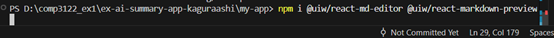

### Step 3 — Configure environment variables
Create `my-app/.env.local` (do NOT commit it). The backend uses a Supabase **service role** key on the server only, so you must keep it secret.

Minimum required for Supabase:
- `SUPABASE_URL`
- `SUPABASE_SERVICE_ROLE_KEY`

Recommended for this app:
- `SUPABASE_BUCKET=documents`

LLM (GitHub Models) required:
- `LLM_BASE_URL=https://models.github.ai/inference`
- `LLM_MODEL=openai/gpt-4.1-mini` (or any model allowed by your account)
- `GITHUB_TOKEN=<YOUR_GITHUB_MODELS_TOKEN>`

Example:

```bash
SUPABASE_URL=<YOUR_SUPABASE_URL>
SUPABASE_SERVICE_ROLE_KEY=<YOUR_SUPABASE_SERVICE_ROLE_KEY>
SUPABASE_BUCKET=documents

LLM_BASE_URL=https://models.github.ai/inference
LLM_MODEL=openai/gpt-4.1-mini
GITHUB_TOKEN=<YOUR_GITHUB_MODELS_TOKEN>
```

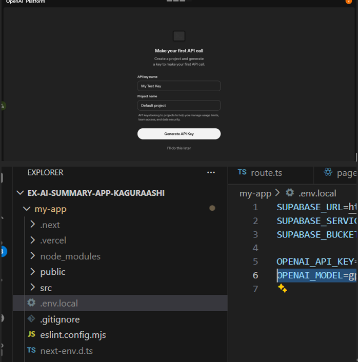

### Step 4 — Set up Supabase Storage bucket
In the Supabase Dashboard, create a Storage bucket named `documents`. I kept it private (default) and used signed URLs when the frontend needs to open a file.

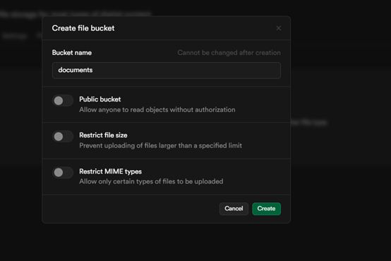

### Step 5 — Set up the Postgres table
Create the `documents` table (SQL Editor). This stores file metadata and the saved AI summary.

```sql
create table if not exists public.documents (
  id bigserial primary key,
  storage_path text not null,
  original_name text not null,
  mime_type text,
  size_bytes bigint,
  created_at timestamptz not null default now(),
  summary text
);
```

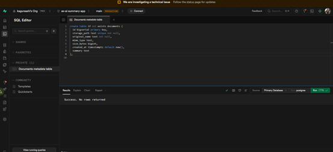

### Step 6 — Run locally
Start the dev server:

```bash
npm run dev
```

Open `http://localhost:3000`. You should see the main “Document Workspace” UI.

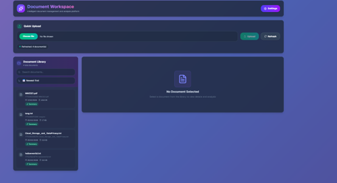

### Step 7 — Test upload + list + refresh (happy path)
1) Choose a file (txt or pdf)
2) Upload
3) Click Refresh to reload the list from Supabase

Expected results:
- The file appears in the list on the left
- Supabase Storage shows the object in the `documents` bucket
- Supabase Table Editor shows a new row in `documents`


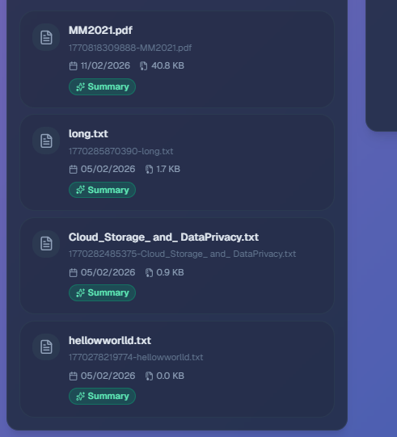

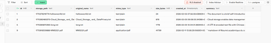

### Step 8 — Preview in the right-side document panel
Click any file in the left list. The right panel opens.

Expected results:
- PDF Viewer tab renders the PDF **inside the app**
- Extracted Text tab shows extracted text (for PDFs that contain extractable text)
- Summary tab shows stored summary (if exists) and supports Generate / Regenerate

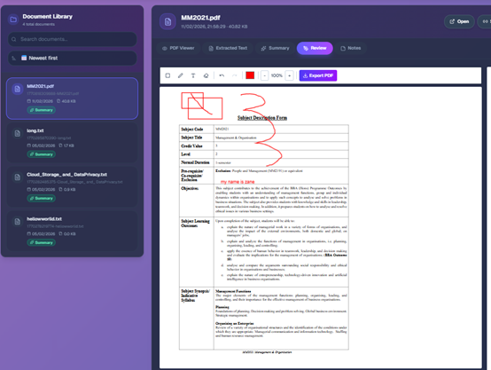
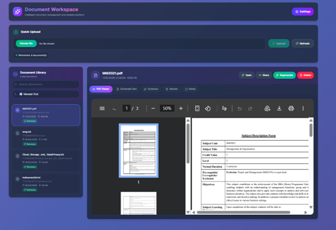
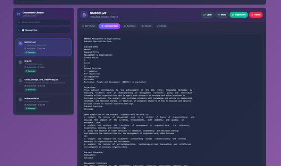

### Step 9 — Summary settings + regenerate
Open Settings and configure:
- Output language (Auto / English / 中文(繁體) / 中文(简体) / 日本語 / 한국어)
- Length (Short / Medium / Long)
- Style (Bullet / Structured / Academic / Executive)
- Custom Instructions (free text)

Expected results:
- Settings persist to localStorage
- Regenerate Summary uses your selected options
- Summary is returned in Markdown

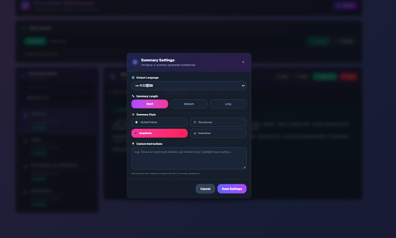
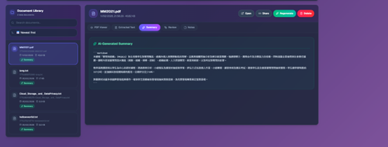

update in 2026 2/12 , the summary can be edited ,which in markdown editor format:
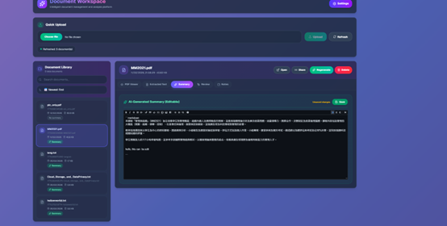

### Step 10 — Review annotations + export reviewed PDF
Open the Review tab and use the tools:
- Rectangle / Pen / Text / Eraser
- Undo / Redo
- Export PDF

Expected results:
- You can draw/mark on top of the PDF inside the app
- Review notes are autosaved (localStorage baseline)
- Export creates a new annotated PDF and returns a URL (download/open)

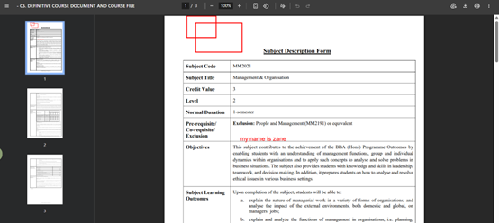

### Deployment notes (Vercel)
For production deployment, add the same environment variables in Vercel Project Settings. Local `.env.local` is not available in production by default.


After deployment, repeat Steps 7–10 in the deployed URL to confirm production parity.

---

After you can reproduce the app with the steps above, the rest of this document (Section 6 onward) provides my development story, evidence screenshots, and how I tested edge cases.


## Section 6: Supabase Object Store
Supabase is an open-source Firebase alternative that provides developers with a complete backend-as-a-service platform centered around PostgreSQL, a powerful relational database system offering full SQL capabilities, real-time subscriptions, and robust extensions for scalable data management. Its object storage is an S3-compatible service designed for storing and serving files like images, videos, and user-generated content.

Website: https://supabase.com/

**Requirements**:
- Build a document upload and file management system powered by Supabase. The backend will include API endpoints to interact with Supabse.
- **Note:** The detailed requirement will be discussed in week 4 lecture.
- Make regular commits to the repository and push the update to Github.
- Capture and paste the screenshots of your steps during development and how you test the app. Show a screenshot of the documents stored in your Supabase Object Database.

Test the app in your local development environment, then deploy the app to Vercel and ensure all functionality works as expected in the deployed environment.

**Steps with major screenshots:**


I started Task 2 by setting up Supabase as the backend for file storage and document metadata. I created a new Supabase project first, then kept the setup simple so I could focus on getting the upload flow working from end to end.

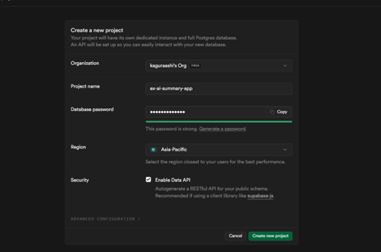


After the project was ready, I created a Storage bucket named documents and kept it private so files are not publicly readable by default.


I also prepared the database side early by creating the documents table in Supabase using the SQL Editor, because I knew I would need metadata storage and later a place to store AI summaries.


On the app side, I implemented the upload and file management workflow using Next.js API routes under my-app/src/app/api. I stored all Supabase credentials and API keys in my-app/.env.local during development, and I made sure .env.local is ignored by git so no secrets are committed to GitHub. At this stage I planned to try OpenAI first, so I put both Supabase variables and OpenAI variables in .env.local from the beginning.


I made regular commits and pushed to GitHub while building each piece, but after multiple commits I ran into a frustrating issue. The app was running, but the UI looked completely wrong. It was basically plain HTML text with no styling and no proper layout. Functionally the routes existed, but the user experience was clearly not acceptable.

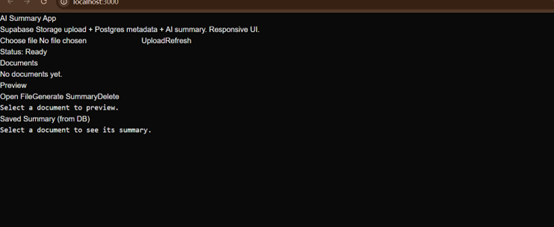

I could not immediately tell where the problem was, so I used Copilot Agent mode and attached the whole project folder. I asked it to find the smallest possible fix and focus on configuration or pipeline issues, because I did not want it to rewrite my pages.

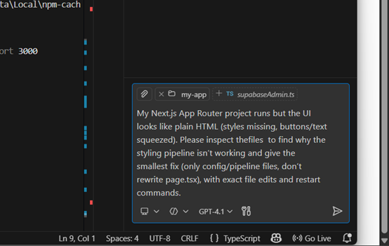

After following the direction and testing again locally, I hit an error page. That error made the root cause clear: the Tailwind styling pipeline was not being loaded correctly through PostCSS.

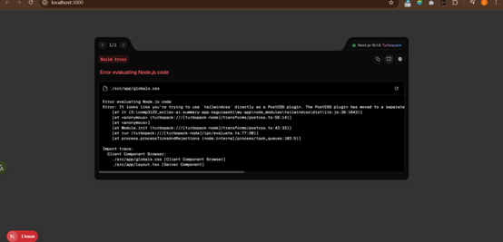

I fixed it by correcting the PostCSS configuration so Tailwind is wired properly, then restarted the dev server.

below code is what i rewrite, i was able to find it thanks to Agent Mode, because it modified the same postcss.config.mjs file for me, even though it still made a mistake.

const config = {
  plugins: {
    "@tailwindcss/postcss": {},
    autoprefixer: {},
  },
};

export default config;


After that change, the UI finally loaded correctly and the app looked like a real application instead of plain HTML. This was a big lesson for me because it showed that AI can help generate features quickly, but it can still miss basic build configuration issues, and I still need to validate the foundation myself.
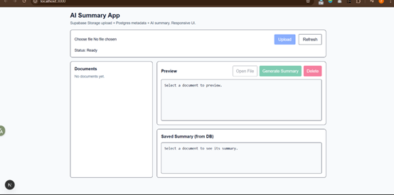


Once the UI was fixed, I tested the upload flow again locally. I uploaded a small text file and confirmed it appears in the document list and preview works.

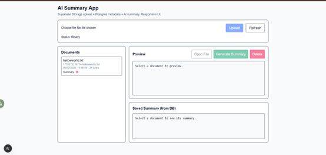

I then checked the Supabase Dashboard to confirm the uploaded file really exists inside the documents bucket, not just in the UI.
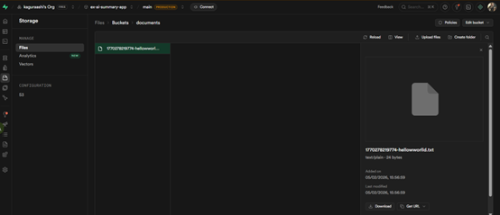


## Section 7: AI Summary for documents
**Requirements:**  
- **Note:** The detailed requirement will be discussed in week 4 lecture.
- Make regular commits to the repository and push the update to Github.
- Capture and paste the screenshots of your steps during development and how you test the app.
- The app should be mobile-friendly and have a responsive design.
- **Important:** You should securely handlle your API keys when pushing your code to GitHub and deploying your app to the production.
- When testing your app, try to explore some tricky and edge test cases that AI may miss. AI can help generate basic test cases, but it's the human expertise to  to think of the edge and tricky test cases that AI cannot be replace. 

Test the app in your local development environment, then deploy the app to Vercel and ensure all functionality works as expected in the deployed environment. 


**Steps with major screenshots:**


After the upload and preview flow was stable, I implemented AI summarization. I built it as a backend endpoint so the API key is never exposed in the browser. The backend downloads the selected document from Supabase Storage, sends the content to an LLM to generate a concise summary, and saves the summary so it can be displayed later in the UI.


Next, I deployed the app to Vercel,
 but the first deployment did not work
 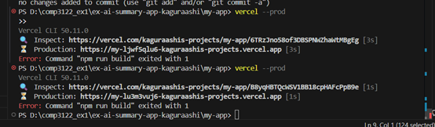

 After consulting AI, I learned that this might be the reason
 :
because the environment variables from .env.local do not exist in production

 


 I initially assumed Vercel could reuse local variables, but it cannot. I fixed it by adding the required environment variables manually in Vercel Project Settings, including the Supabase keys and the AI key.


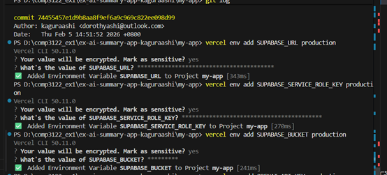


After adding the variables, I redeployed and verified the production version works the same as local testing.


For AI api key , my first attempt was to use the OpenAI API directly. I created an API key and kept it in .env.local so it would never be committed.Since I figured I was going to use GPT4 Mini anyway, I wanted to minimize bugs and just use the open ai 's official website's settings.


When I tested summarization, the request failed with a 403 error saying the country, region, or territory is not supported. This was another real-world constraint that the code itself cannot solve.
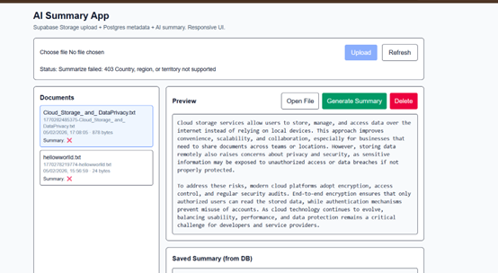


To make the feature work reliably, I switched to a compatible AI provider mentioned in the lecture materials and used a GitHub token to call the AI model. I kept the same security pattern: the token stays in environment variables, summarization stays in the backend, and nothing sensitive is exposed to the browser.

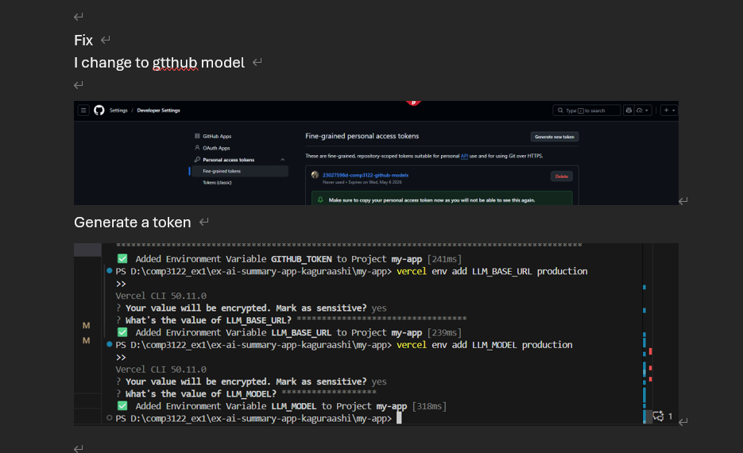

After switching, I tested summarization again and confirmed the summary is generated and displayed correctly.
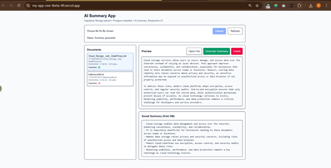

I also verified the app is mobile-friendly using Chrome device toolbar and confirmed the layout still works on a narrow screen.

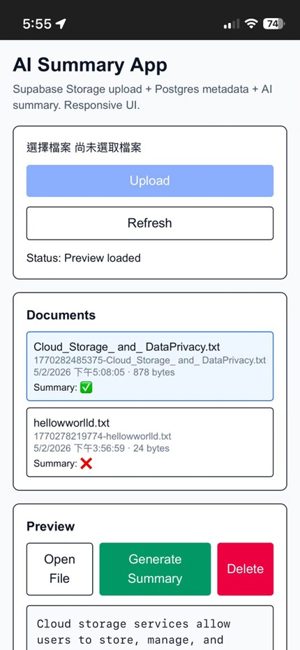

I tested edge cases beyond the basic happy path, because this is where human judgement matters more than AI.

First, I tested uploading an empty file to confirm the backend rejects it with a clear error instead of inserting a broken row. Next, I tested a very long text file to make sure the preview and summarization remain stable by truncating the input to a safe length. I also tested Chinese content and emoji to confirm that encoding is handled correctly end to end.


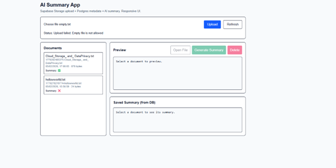
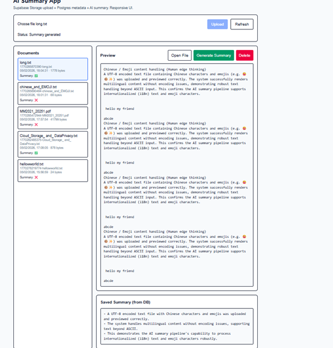
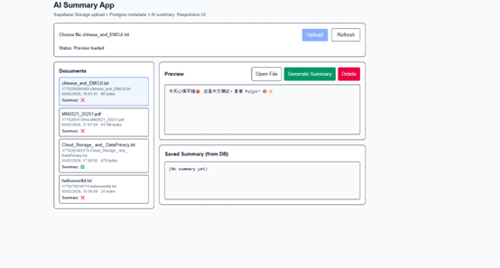

The detail test are provided in the section 11 

new update in 2026 /2 /6 :  in the previous version , only text can be summerized  ,now , PDF can aslo be summerized

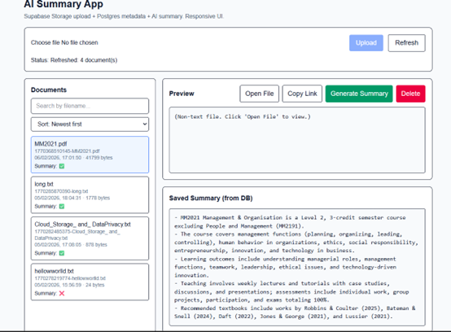


new update 2 in  2026 /2 /6 :  in previous , PDF will not show preview because it will considered as non-text file, now
it can show preview correctly,

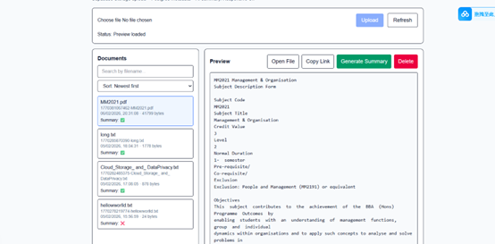

## this is development history , please look at section 10 for new update ##


## Section 8: Database Integration with Supabase  
**Requirements:**  
- Enhance the app to integrate with the Postgres database in Supabase to store the information about the documents and the AI generated summary.
- Make regular commits to the repository and push the update to Github.
- Capture and paste the screenshots of your steps during development and how you test the app.. Show a screenshot of the data stored in your Supabase Postgres Database.

Test the app in your local development environment, then deploy the app to Vercel and ensure all functionality works as expected in the deployed environment.

**Steps with major screenshots:**


To store document metadata and AI summaries properly, I integrated Supabase Postgres into the app. I used the documents table created earlier, then updated the backend so uploads insert a row containing the storage path, filename, MIME type, size, and created time. When a summary is generated, the backend updates the summary field for the same document.
I've already done sufficient preparation for connecting to Superbase in the previous section 6. You can refer to the screenshots from before, as shown in the image below. I've captured the relevant project URL, secret key, and table creation operations from the Superbase webpage.


I verified the database integration by checking Supabase Table Editor and confirming that rows are inserted when I upload files.
I also confirmed that at least one row has its summary updated after generating a summary.
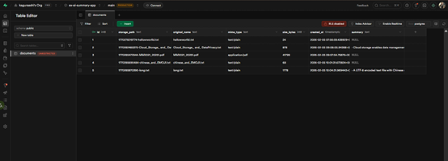


## Section 9: Additional Features [OPTIONAL]
Implement at least one additional features that you think is useful that can better differentiate your app from others. Describe the feature that you have implemented and provide a screenshot of your app with the new feature.


After meeting the core requirements, I added extra features to make the app more usable. I implemented delete so a selected document is removed from Supabase Storage and its corresponding row is removed from Postgres, keeping storage and database consistent.
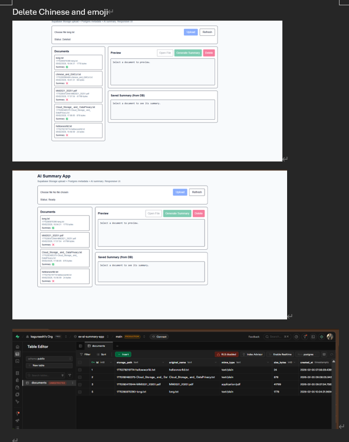

However, after adding the delete function, I wasn't sure what was necessary and helpful, so I decided to seek help from the AI ​​again.After fetching AI 's suggestion , I also wanted to add search and sort function, so I used Copilot Agent mode again. However, usage is already very scarce, this time I explicitly told it not to touch the backend and to keep the change minimal. 

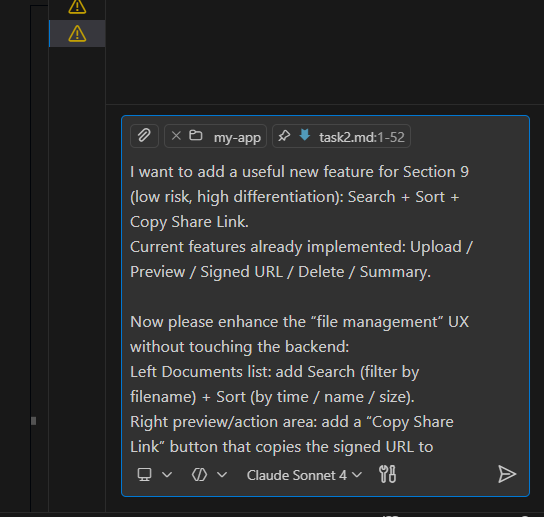

Even with that constraint, the AI still changed more than necessary and added a refresh function that did not actually help, because clicking it did not produce a meaningful state update. I have to reviewed the diff, removed unnecessary parts, and made additional commits until the behavior was clean and predictable.

After my manual cleanup and additional commits, the final version had working sorting and searching with a simpler UI.
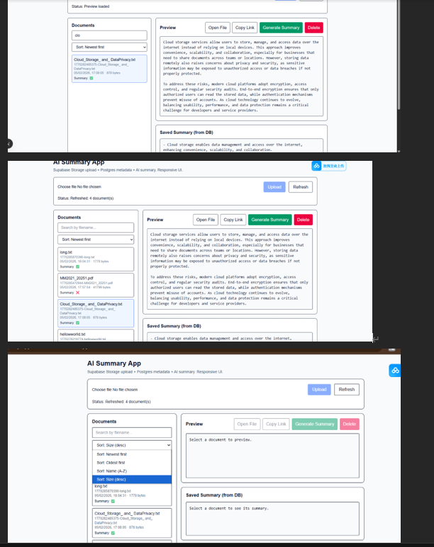

I also added a copy link feature for quickly sharing a short-lived signed URL, which is useful for non-text files that cannot be previewed directly in the UI.


By the end of this task, I had a clearer understanding of AI-assisted programming. AI helped me move faster, but it did not automatically guarantee quality. It missed a basic UI pipeline configuration issue at first, and it tended to over-change files when adding new features. The final result still required human judgement to debug real root causes, decide which changes are necessary, and design edge-case tests that reflect real user behavior.However, I feel that I'm reluctant to use overly powerful AI because it would significantly consume usage.So it's possible that the AI ​​I chose was too weak, which is why I had to follow up with so many steps.

## Section 10: Update on 12 Feb 2026 

On 12 Feb 2026, I reviewed the Week 4–5 exercise requirements again and realized my earlier implementation was not fully aligned. In particular, the AI summary needed user-facing settings so users could control the output language and add custom requirements, the PDF should be viewable inside the app instead of opening a new browser tab, and the PDF viewer should support review markups (writing and drawing). I decided to keep my earlier commits as evidence of development history, and I used feature branches so I could experiment without breaking the stable version.

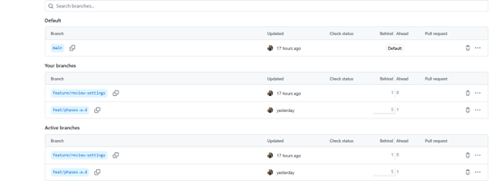

During this iteration, I hit several real debugging problems that were not obvious from code generation alone. The first problem was a build-time error where Next.js could not resolve a dependency used by the Notes/Markdown editor. The UI would not start until I installed the correct dependency and ensured npm install was executed inside the my-app folder.

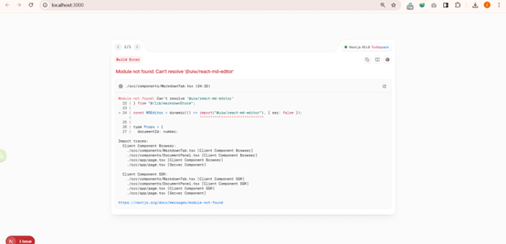

After I introduced the in-app PDF review feature, I encountered a runtime error related to react-pdf and pdf.js. The error indicated DOMMatrix is not defined. This happened because parts of pdf.js can be evaluated in a server context if the component is not isolated correctly. I resolved this by moving the PDF rendering code into a dedicated client component and ensuring the PDF worker is configured only on the client side.

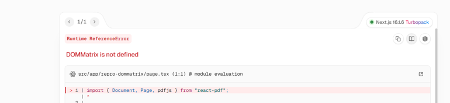

When the viewer started to render, the console showed warnings about missing TextLayer and AnnotationLayer styles. I fixed this by disabling those layers for this project, because my markup layer is handled by a Konva canvas overlay. This removed the warnings and avoided relying on extra CSS files.


The most confusing issue was a PDF worker mismatch: the API version and worker version did not match. This caused Failed to load PDF file even though the signed URL was correct. I fixed this by pointing pdfjs.GlobalWorkerOptions.workerSrc to the worker file shipped with the installed pdfjs-dist version, so the worker and API versions stay consistent.

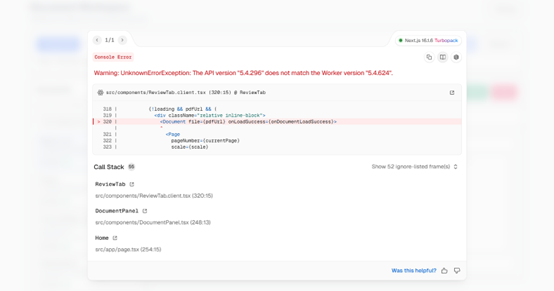
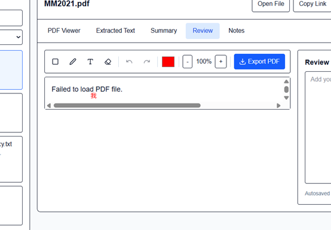

Finally, I had a UI-level bug where the PDF could display but I could not draw or write any annotations. The toolbar buttons changed state, but the canvas overlay did not receive pointer events, so nothing was created. I resolved this by adjusting the overlay layer to accept pointer events and by mapping pointer coordinates correctly onto the Konva stage. After that fix, I could create rectangle, pen strokes, and text annotations reliably, and I could export a reviewed PDF.

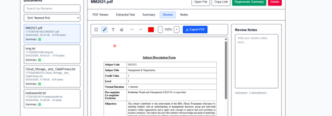
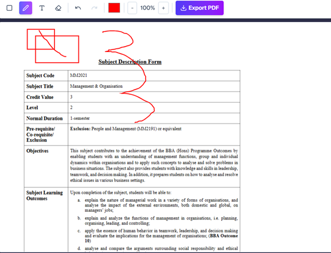


This update also changed how I think about AI-assisted development. AI was helpful for generating initial code, but the integration problems were real and required human judgement: identifying root causes, checking runtime context (server vs client), ensuring dependency versions match, and designing edge-case tests that reflect how users actually use the app.


## Section 10A: What I actually did to resolve each issue (commands + file-level fixes)

I wrote down what I actually did, in the same order I debugged it, so a beginner can reproduce both the bugs and the fixes. For each problem, I kept the original error screenshot that is already above in Section 10, and then I added extra screenshots from my VS Code editor and terminal to prove the fix really worked.

The first issue was a build-time error where Next.js could not resolve `@uiw/react-md-editor`. This happened because I had previously run `npm install` in the wrong place (the repository root, not the `my-app/` folder). As a result, the dependency was not installed inside `my-app/node_modules`, so the UI could not start. The fix was simply to go into the correct folder and install the missing editor packages, then restart the dev server. After that, I checked that `package.json` showed the dependency and the app booted normally.

I ran these commands in PowerShell:

cd ex-ai-summary-app-kaguraashi/my-app
npm i @uiw/react-md-editor @uiw/react-markdown-preview
npm run dev

Here is the evidence I captured for the fix:
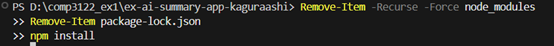
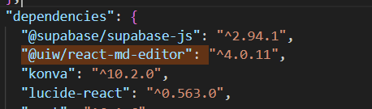

This was a very typical human mistake that AI cannot reliably detect by itself. The error message looks like “missing dependency,” but the real root cause was simply that I executed the correct workflow in the wrong directory.

The second issue appeared after I introduced in-app PDF reviewing. I hit a runtime error that said `DOMMatrix is not defined`. This happened because parts of `pdf.js` are browser-only, but in Next.js App Router, code can accidentally be evaluated in a server context if the component is not isolated as client-only. The way I fixed it was to move the real PDF rendering into a dedicated client component and then load it with SSR disabled using a dynamic wrapper. Concretely, I made sure the renderer file starts with `"use client";`, and then I created a wrapper component that imports it with `dynamic(..., { ssr: false })` so Next.js never tries to execute the PDF rendering code on the server.

Here is the evidence I captured for those changes:
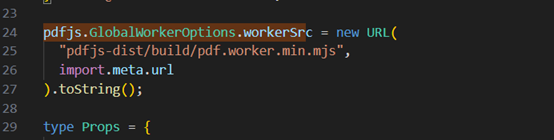
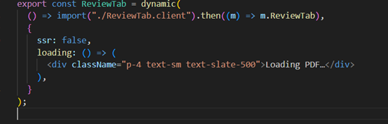

The exact pattern I used in `src/components/ReviewTab.tsx` looks like this (written as plain text here, not as a code block):

import dynamic from "next/dynamic";
const ReviewTabClient = dynamic(() => import("./ReviewTab.client"), { ssr: false });
export function ReviewTab(props: any) { return <ReviewTabClient {...props} />; }

This taught me a major lesson about Next.js: passing TypeScript checks and compiling successfully does not guarantee runtime correctness. I had to think about where the code runs (server or client), not just whether it compiles.

The third issue was not a crash, but annoying console warnings about missing TextLayer and AnnotationLayer styles. react-pdf can render those layers, but they rely on extra CSS. In my project, I already use a Konva overlay for drawing and markup, so I did not want extra layers (and extra CSS requirements) creating noise or conflicts. The fix was to explicitly disable those layers on the `Page` component so react-pdf stops trying to render them.

I changed the `Page` render options to include `renderTextLayer={false}` and `renderAnnotationLayer={false}`.


The fourth issue was the most confusing: `API version does not match the Worker version`, and the UI symptom was “Failed to load PDF file,” even though the signed URL was correct. This happened because I originally pointed the worker to a URL that did not match the installed `pdfjs-dist` version. When the API and the worker are out of sync, rendering fails even if everything else is correct. I fixed it by pointing `pdfjs.GlobalWorkerOptions.workerSrc` to the worker shipped with the installed `pdfjs-dist` package, so the worker and API versions always stay aligned. After changing the worker source, I restarted the dev server because worker changes do not always hot-reload reliably.

The worker configuration I used (written as plain text) was:

pdfjs.GlobalWorkerOptions.workerSrc = new URL("pdfjs-dist/build/pdf.worker.min.mjs", import.meta.url).toString();

Here is the evidence of the fix:
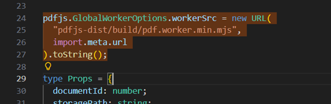

This was another practical lesson about AI-assisted coding. AI can suggest “a worker URL,” but the correct solution is not guesswork. The correct solution is enforcing strict version alignment.

The fifth issue was a UI-level bug where the PDF displayed, the toolbar buttons changed state, but I could not actually draw or write annotations. The overlay simply did not receive input events, so nothing was created. The fix was to make sure the Konva Stage overlay is really above the PDF layer, that it accepts pointer events, and that I read pointer positions from the stage and store coordinates in the same coordinate system used for rendering. After this fix, I could reliably create rectangles, pen strokes, and text annotations, and I could export a reviewed PDF.


This bug was a good reminder that UI state can look correct while input is silently blocked. The right approach was to debug event flow and coordinate mapping, not to assume that the drawing logic itself was wrong.

## Section 10B: Key implementation snippets for the latest features 


For the PDF renderer, I configured the worker inside the client component. This avoided both the SSR crash and the worker mismatch issue, because the worker path comes from the installed package. The key idea was simply that the worker must be configured on the client side, and the worker must match the installed pdfjs-dist version.


I also fixed a real usability bug in the Review toolbar. The icons were unreadable because they inherited a light color while the toolbar background was white. I did not change any logic. I only added explicit text colors and a clear active-state style so the icons are always readable. This was a styling-only fix, but it had a big usability impact because the toolbar was effectively unusable before the fix.

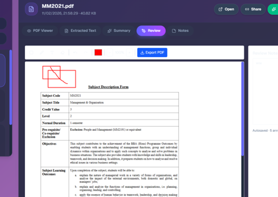

For summary settings, I implemented a complete flow from UI controls to localStorage persistence, and then into the summarize API payload. The reason I did it this way is that summary settings are user preferences, so they should survive page reloads, and they should affect regeneration consistently. The summarize API then stores the returned summary in the database so it is stable and consistent across refreshes.

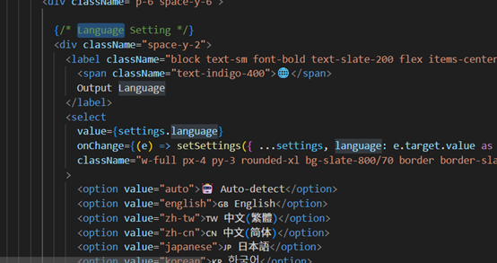


For exporting reviewed PDFs, I kept the export logic server-side using pdf-lib. This is important because the browser should never hold a Supabase service   role key. The server downloads the original PDF, applies the saved annotations, uploads the reviewed PDF back to storage, and then returns a signed URL so the user can open or download it safely.


Section 10C: Reflection (AI-assisted development, but real engineering responsibility)

This iteration changed my mindset in three ways. First, AI is fast at generating the “shape” of features, but the hardest problems I faced were integration problems: server-versus-client runtime boundaries, worker version alignment, hidden CSS assumptions, and UI input-event layers. Those issues required systematic debugging and understanding how the runtime actually behaves, not just generating more code.

Second, keeping changes minimal mattered a lot. I used feature branches to isolate risk, reviewed git diff after each major change, and removed unnecessary modifications that could regress core features like upload, list/refresh, delete, extracted text, and summarization.

Third, collecting evidence improved my quality. Capturing screenshots of errors and fixes forced me to verify my claims. It also made the final report more credible, because the screenshots show that I really encountered the issues and really resolved them.

## Section 11: Final testing strategy and test cases 

I wrote this section specifically to satisfy the assignment requirement to describe how I tested the app. I tested both local development and the Vercel deployed build, because environment variables, storage permissions, and PDF rendering details can behave differently in production.

I tested locally on Windows using PowerShell, running the app with `npm run dev` and accessing it at `http://localhost:3000`.


I also tested the production deployment on Vercel. Before testing the deployed URL, I confirmed that all environment variables were configured in Vercel Project Settings, because `.env.local` is not available in production.


During development, I used a regression mindset: after every major change, I re-tested the same core flows to ensure I did not break anything. The core flows I always re-checked were uploading, listing and refreshing, deleting, opening the document panel, verifying that the original tabs still work for PDF Viewer, Extracted Text, Summary, verifying that extracted text still displays correctly, verifying that summary generate and regenerate still work, and verifying that the settings dialog still opens and persists options. I also re-tested the new tabs ，for Review and Notes, because they touch PDF rendering and localStorage persistence.


For normal happy path manual testing, I started with boot and navigation reliability. I verified that the app boots locally without build errors and that the UI loads correctly, then I verified that the deployed Vercel build boots and can call the API routes. 


I then tested the upload flow with a small TXT file. The expected result was that a new row is inserted into the documents table, the file appears in the documents bucket, and the file appears in the UI list. 


Next, I tested uploading a normal text-based PDF. The expected result was that the PDF is viewable inside the app, extracted text is available, and summarization works. 
I also tested refresh to ensure the list reloads cleanly from Supabase and does not create duplicates:


I tested the Extracted Text tab on a text-based PDF:


I tested summary regeneration after changing settings, and confirmed the output reflects language, length, style, and custom instructions:


I have tested that settings persist across reloads by reopening the app and confirming the same values were still present

For the Review tab, I tested that the rectangle tool, pen tool, and text tool all create visible annotations and that annotations persist:


I tested zoom in and zoom out to confirm the PDF scales correctly and the overlay remains aligned:


I also tested exporting a reviewed PDF after creating annotations and confirmed the reviewed PDF is generated and accessible


## edge test 


For exceptional and edge cases, I tested scenarios that commonly break real apps. 

I tested uploading an empty file, expecting the backend to reject it and not insert a broken database row:


I tested a very large text file, expecting the preview to remain stable and summarization to truncate safely without crashing or timing out:


I tested Unicode and emoji to confirm correct encoding throughout the pipeline:


I tested scanned or image-only PDFs (no extractable text). The expected result is that the PDF viewer still renders pages, but extracted text and summarization fail gracefully with a clear message, without crashing the app:


I tested file type confusion by renaming a binary file to .txt, expecting the backend to reject or handle it safely instead of attempting to treat it as plain text,
but in fact this is fail, and i try different way , i find the app stil handle it ,


i tested the summary can be edited and saved success


This was a small but meaningful reminder for me: a file extension is not a reliable security signal, and an AI-assisted workflow can make it easy to assume the “happy path” is representative. Working with AI during development helped me move faster, but this case taught me that speed must be paired with deliberate adversarial testing. Even though I did not fully implement a robust fix here, I now have a clearer understanding of what safe handling should look like. Since this project has consume me too much time, may be i will update it later,


These tests mattered because AI can easily suggest happy-path tests, but the failures I actually hit were mostly environment and integration problems. That is why I deliberately tested local versus Vercel configuration, PDF-specific failure modes, UI input-event reliability, and safe failure behavior. These are the cases that reflect real user behavior and real deployment conditions, and they are also the cases that taught me the most during this AI-assisted development process.
